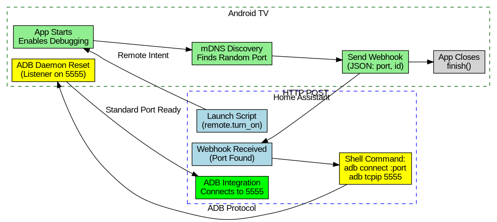

# Local WiFi Debug

**Local WiFi Debug** is a specialized Android application (Kotlin) designed to automate the synchronization of the **Wireless Debugging** port on Android TV devices (like Chromecast with Google TV) with **Home Assistant**.

## Why this exists
The Android TV (ADB) Integration in Home Assistant often loses connection because:
1.  **Wireless Debugging is disabled on reboot** by the Android system.
2.  **The port is randomly assigned** each time Wireless Debugging is toggled on.

This app allows for a "one-click" sync that:
1.  Enables Wireless Debugging (if not already on).
2.  Discovers the current random port using mDNS.
3.  Reports that port to a Home Assistant webhook.

## How it Works
The following diagram illustrates the automated sequence from launching the app to establishing a stable ADB connection on port 5555:



## Key Features
- **Zero-Touch Execution:** The app performs its task and closes itself immediately upon launch.
- **mDNS Service Discovery:** Uses `NsdManager` to find the `_adb-tls-connect._tcp.` service locally.
- **Quick Settings Tile:** Includes a "WiFi Debug Sync" tile for devices that support it.
- **Visual Feedback:** Provides system-level notifications and Toast messages on the TV.

## Requirements
- **Static IP Address:** It is highly recommended to assign a static IP address (or DHCP reservation) to your Android TV device for reliable ADB connections.
- Android 11+ (Required for Wireless Debugging).
- ADB access to grant initial secure permissions.
- **Home Assistant Android TV Remote Integration:** Required to remotely launch the app on the TV.
- Home Assistant with an active Webhook automation.

## Cloning the Repository
To get started, clone this repository to your local machine:
```bash
git clone https://github.com/stevene1919/localwifidebug.git
cd localwifidebug
```

## Build Prerequisites
Before building the project, ensure you have the following installed:

1.  **Java Development Kit (JDK) 17:**
    - On Linux (Ubuntu/Debian): `sudo apt install openjdk-17-jdk`
    - On macOS: `brew install openjdk@17`
    - On Windows: Download from Oracle or Adoptium.
    - Set `JAVA_HOME` environment variable to your JDK path.

2.  **Android SDK:**
    - Download and install the [Android Command Line Tools](https://developer.android.com/studio#command-line-tools-only).
    - Use `sdkmanager` to install required components:
      ```bash
      sdkmanager "platforms;android-34" "build-tools;34.0.0" "extras;google;m2repository" "extras;android;m2repository"
      ```
    - Set `ANDROID_HOME` environment variable (e.g., `export ANDROID_HOME=$HOME/android-sdk`).

3.  **Gradle:**
    - If `gradlew` is not present in the root directory, you can install Gradle manually:
    - On Linux: `sudo apt install gradle`
    - On macOS: `brew install gradle`
    - Or generate the wrapper if you have Gradle installed: `gradle wrapper`.

## Building the APK

### Standard Environment
If you are building on a standard x86_64 machine:
```bash
./gradlew assembleDebug
```

### ARM64 Environment (e.g., Raspberry Pi)
If building on an ARM64 Linux host, you must provide a native `aapt2` binary at the project root as the standard SDK binary is x86 only:
1.  Place a native `aapt2` binary in the root directory.
2.  Run the build:
    ```bash
    export ANDROID_HOME=$HOME/android-sdk
    ./gradlew assembleDebug
    ```

## Installation

This section details the one-time setup required on your Android TV device to enable wireless debugging and install the app.

1.  **Enable Developer Options on your Android TV:**
    *   Go to "Settings" -> "System" -> "About".
    *   Scroll down and repeatedly click on "Build" (7 times) until you see a message that "You are now a developer!".

2.  **Enable Wireless Debugging:**
    *   Go back to "Settings" -> "System" -> "Developer Options".
    *   Find and enable "Wireless debugging". Make a note of the IP address and pairing code displayed.

3.  **Pair your device (if required):**
    If this is the first time you're using wireless ADB with this device, you may need to pair it. Use the IP address and pairing code from Step 2.
    ```bash
    adb pair <TV_IP_ADDRESS>:<PORT_FROM_TV>
    # You will be prompted to enter the pairing code shown on your TV.
    ```
    *(Note: Your PC's ADB client must be recent enough to support `adb pair`)*

4.  **Connect via ADB to your TV** (replace with your TV's IP address and the random port from Step 2):
    ```bash
    `adb connect <TV_IP_ADDRESS>:<RANDOM_PORT_FROM_TV>`
    ```

5.  **Install the APK:**
    ```bash
    adb install app/build/outputs/apk/debug/app-debug.apk
    ```

6.  **Grant Critical Permissions:**
    Run these commands via ADB to grant the necessary secure permissions declared in the manifest (`WRITE_SECURE_SETTINGS` and `POST_NOTIFICATIONS`):
    ```bash
    # Allow the app to toggle Wireless Debugging
    adb shell pm grant com.enuff.steven.localwifidebug android.permission.WRITE_SECURE_SETTINGS

    # Allow notifications (Android 13+)
    adb shell pm grant com.enuff.steven.localwifidebug android.permission.POST_NOTIFICATIONS
    ```

7.  **Grant Extra Permissions (Full Command Set):**
    While some are auto-granted, you can ensure all permissions are set using these commands:
    ```bash
    adb shell pm grant com.enuff.steven.localwifidebug android.permission.INTERNET
    adb shell pm grant com.enuff.steven.localwifidebug android.permission.ACCESS_NETWORK_STATE
    adb shell pm grant com.enuff.steven.localwifidebug android.permission.WRITE_SECURE_SETTINGS
    adb shell pm grant com.enuff.steven.localwifidebug android.permission.POST_NOTIFICATIONS
    ```

## Configuration
**Important:** The following values are currently hardcoded in `MainActivity.kt` and `WiFiDebugTileService.kt` and **MUST be modified** for your specific Home Assistant environment:
-   **Webhook URL:** `http://192.168.50.200:8123/api/webhook/ccwgt_port`
-   **Device ID:** `ccwgt`

You will need to update these values in the source code to match your Home Assistant instance's IP address and desired webhook ID/device identifier.


## Home Assistant Integration

*(Important Note: If your Android TV device requires ADB pairing, you must also perform the `adb pair` command from the machine where your Home Assistant instance runs its ADB shell commands. This is typically a one-time setup.)*

### 1. Webhook Automation
Create an automation in HA to handle the incoming port and trigger a reconnection:
```yaml
alias: "Update ADB Port for TV"
description: "Updates the ADB port when the WiFi Debug app reports a new one"
trigger:
  - platform: webhook
    webhook_id: ccwgt_port
    allowed_methods:
      - POST
    local_only: true
action:
  - service: shell_command.reconnect_adb_tv
    data:
      port: "{{ trigger.json.port }}"
```

### 2. Shell Command
Add this to your `configuration.yaml`. This command sequence uses the random port reported by the app to establish a temporary ADB connection, then instructs the TV to restart its ADB daemon and listen on the standard port `5555` via `adb -s <TV_IP_ADDRESS>:{{ port }} tcpip 5555`.
```yaml
shell_command:
  reconnect_adb_tv: "adb connect <TV_IP_ADDRESS>:{{ port }} && adb -s <TV_IP_ADDRESS>:{{ port }} tcpip 5555 && adb disconnect <TV_IP_ADDRESS>:{{ port }}"
```
*(Note: Ensure the `adb` binary is installed and available to the Home Assistant process/container)*

### 3. Launch Script
Add this to `scripts.yaml` to trigger the sync from your HA dashboard. This uses the `android_tv_remote` integration to start the application:
```yaml
sync_local_wifi_debug:
  alias: "Sync Local WiFi Debug"
  sequence:
    - service: remote.turn_on
      target:
        entity_id: remote.steven_tv  # Entity from Android TV Remote integration
      data:
        activity: "com.enuff.steven.localwifidebug/.MainActivity"
```

## License
MIT

## Disclaimer
This project was coded using Gemini CLI. Your mileage may vary.
